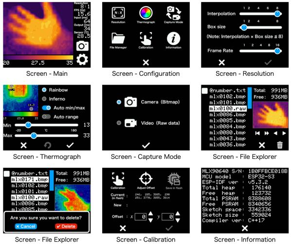

# MLX90640 Thermography Camera by XIAO ESP32S3

## Description

Program for thermal imaging camera with MLX90640 far-infrared (IR) thermal sensor srray for ESP32-2432S028R and XIAO ESP32S3

## Features

### Menu GUI

It comes with a graphical user interface to properly configure the MLX90640 for different scenarios.

- Display frame rate: 1 FPS (min) / 16 FPS (max)
- Resolution: 32 x 24 (min) / 256 x 192 (max)
- Heat map mode: Rainbow / Inferno
- Measurement range: Auto scaling / Manual adjustment.
- Measurement features: Automatic min/max / a specified point.
- Screen capture: Save 320 x 240 bitmap (24-bit) to SD card.
- Video recording: Record 32 x 24 raw data continuously onto SD card.
- File explorer: Display thumbnails / Play videos on SD card.
- Offline video viewer: Offline video playback on PC
- Touch screen: Calibration on the first launch / in the configuration menu.
