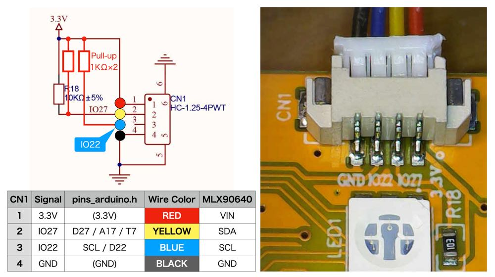
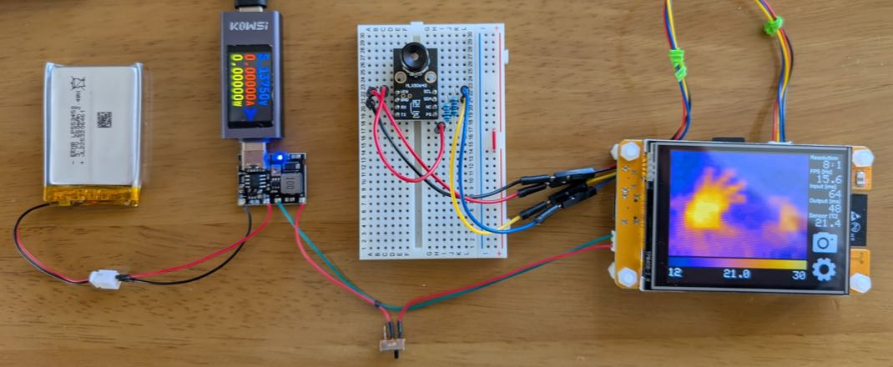

# MLX90640 Thermography Camera for ESP32

## Description

Program for thermal imaging camera with MLX90640 far-infrared (IR) thermal sensor srray for XIAO ESP32S3 and ESP32-2432S028R

## Features

It comes with a graphical user interface to properly configure the MLX90640 for different scenarios.


- Display frame rate: 1 FPS (min) / 16 FPS (max)
- Resolution: 32 x 24 (min) / 256 x 192 (max)
- Heat map mode: Rainbow / Inferno
- Measurement range: Auto scaling / Manual adjustment.
- Measurement features: Automatic min/max / a specified point.
- Screen capture: Save 320 x 240 bitmap (24-bit) to SD card.
- Video recording: Record 32 x 24 raw data continuously onto SD card.
- File explorer: Display thumbnails / Play videos on SD card.
- Offline video viewer: Offline video playback on PC
- Touch screen: Calibration on the first launch / in the configuration menu.

## Demo

### File Explorer
[](https://youtu.be/9El-2NYCDNU)

### MLX90640Viewer
[](https://youtu.be/FFbE1BNb92w)

## Hardware Setup

For GPIO pin assignments, see [`pin_assign.h`](pin_assign.h).

<details>
<summary>XIAO ESP32S3</summary>

### Block Diagram


### Wiring

</details>

<details>
<summary>ESP32-2432S028R (AKA Cheap Yellow Display)</summary>

### Connecting MLX90640 to I2C


### Li-Po Battery


</details>

<details>
<summary>I2C pull-up registers</summary>


</details>

## Software Setup

### Requirements

- Arduino IDE : [2.3.4][1]
- Board package : esp32 by Espressif Systems : [3.1.1][2]  
  Board type:
    - [XIAO_ESP32S3][21]
    - [ESP32-2432S028R CYD][22]
- Adafruit_MLX90640 [1.1.1][3]
- GFX library
  - LovyanGFX : [1.2.0][4]
  - TFT_eSPI : [2.5.43][5]
- Touchscreen library
  - XPT2046_Touchscreen : [Version 1.4][6] (only for TFT_eSPI on CYD)

### File Structure and Dependencies

```
MLX90640.ino
├─ pin_assign.h
├─ heatmap.h
│
├─ mlx.hpp
├─ gfx.hpp
│   │ <LovyanGFX.h>
│   ├─ boards
│   │   ├─ LGFX_CYD_2432S028R.hpp
│   │   └─ LGFX_XIAO_ESP32S3_ST7789.hpp
│   │ <TFT_eSPI.h>
│   ├─ User_Setup.h
│   └─ boards
│       ├─ Setup_CYD_2432S028R.h
│       ├─ Setup_XIAO_ESP32S3_ST7789.h
│       └─ XPT2046_ScreenPoint.h
├─ task.hpp
├─ touch.hpp
├─ sdcard.hpp
├─ filter.hpp
├─ interpolation.hpp
└─ widget.hpp
    ├─ draw.hpp
    │   └─ marker.h
    └─ widgets.hpp
        └─ widgets.h
```

### Configuration

1. Depending on the board type, define pinouts of the I2C for MLX90640 and SPI for LCD / touch screen / SD card in `pin_assign.h`.

2. Configure each step in `MLX90640.ino`. Generally, there is no need to change the default values.
  - Step1: Debugging mode (default: `false`)
  - Step2: Operational specifications
    - `ENA_INTERPOLATION` (default: `true`)
    - `ENA_MULTITASKING` (default: `true`)
    - `ENA_OUTWARD_CAMERA` (`true`: Outward, `false`: Selfie)
  - Step3: GFX library
    - `USE_LOVYAN_GFX` (default: `true`, highly recommended)
        - `USE_AUTODETECT` (default: `true`, or manual settings)
    - `USE_TFT_ESPI`
        - `User_Setup.h` definition required.
  - Step4: Flash memory
    - `USE_PREFERENCES` (default: `false`, `true` is recommended.)
  - Step5: Resolution  
    For low performance MCUs. No modifications required.

### Dual-Core / Multitask

It achieves parallel processing by utilizing multi-cores with FreeRTOS and double-buffering for thermal images.

<details>
<summary>Timing diagram</summary>

- [Timing diagram (Drawio)](https://drive.google.com/file/d/1W-xelIn-PvofRw0Ya43I02ksVurOTiDk/view?usp=sharing)  
  
</details>

## Touch Screen Calibration

The “Calibration Screen” will appear when you run the sketch for the first time after compile & uploading, 
or when you select to run calibration from the menu.

<details>
<summary>Calibration Screen</summary>


</details>

If `USE_PREFERENCES` is set to `true`, you can save the calibration results to flash, but when it's set to `false`, 
you need to open the serial monitor with **115200** bps before running the calibration and embed the displayed data into 
[`touch.hpp`](https://github.com/embedded-kiddie/MLX90640/blob/main/touch.hpp#L25-L48) after calibration is completed.

## Related Project
- [MLX90640Viewer](https://github.com/embedded-kiddie/MLX90640Viewer)  
    The MLX90640Viewer is a tool that applies heatmaps and visualizes the output of the Melexis MLX90640 32x24 IR array, 
    which is stored as continuous raw data in a file.

- [MLX90640 for Arduino UNO R4][23]

## Resouces

- [Melexis MLX90640][7]
  - [Datasheet][8]
    - I2C Frequency: 1MHz (Fast mode+)
  - [Breakout board: GY-MCU90640][9]
    - [Alliexpress][10]

- [Seeed Studio XIAO ESP32S3][11]
  - [ESP32-S3 Series Datasheet][12]
  - [ESP32 Technical Reference Manual][13]

- [witnessmenow/ESP32-Cheap-Yellow-Display][20]


[1]: https://www.arduino.cc/en/software "Software｜Arduino"

[2]: https://github.com/espressif/arduino-esp32/releases/tag/3.1.1 "Release Arduino Release v3.1.1 based on ESP-IDF v5.3.2 · espressif/arduino-esp32"

[3]: https://github.com/adafruit/Adafruit_MLX90640 "adafruit/Adafruit_MLX90640: MLX90640 library functions"

[4]: https://github.com/lovyan03/LovyanGFX/releases/tag/1.2.0 "Release 1.2.0 · lovyan03/LovyanGFX"

[5]: https://github.com/Bodmer/TFT_eSPI/releases/tag/V2.5.43 "Release Bug fixes · Bodmer/TFT_eSPI"

[6]: https://github.com/PaulStoffregen/XPT2046_Touchscreen/releases/tag/v1.4 "Release Version 1.4 · PaulStoffregen/XPT2046_Touchscreen"

[7]: https://www.melexis.com/en/product/MLX90640/Far-Infrared-Thermal-Sensor-Array "Far Infrared Thermal Sensor Array (32x24 RES) I Melexis"

[8]: https://www.melexis.com/en/documents/documentation/datasheets/datasheet-mlx90640 "Datasheet for MLX90640 I Melexis"

[9]: https://github.com/vvkuryshev/GY-MCU90640-RPI-Python/blob/master/GY_MCU9064%20user%20manual%20v1.pdf "vvkuryshev/GY-MCU90640-RPI-Python: The script to connect the thermal image module GY-MCU90640 to Raspberry Pi."

[10]: https://www.aliexpress.com/item/1005006674751991.html

[11]: https://wiki.seeedstudio.com/xiao_esp32s3_getting_started/ "Getting Started with Seeed Studio XIAO ESP32S3 (Sense) - Seeed Studio Wiki"

[12]: https://www.espressif.com/sites/default/files/documentation/esp32-s3_datasheet_en.pdf

[13]: https://www.espressif.com/sites/default/files/documentation/esp32_technical_reference_manual_en.pdf

[20]: https://github.com/witnessmenow/ESP32-Cheap-Yellow-Display "witnessmenow/ESP32-Cheap-Yellow-Display: Building a community around a cheap ESP32 Display with a touch screen"

[21]: https://github.com/espressif/arduino-esp32/tree/master/variants/XIAO_ESP32S3 "arduino-esp32/variants/XIAO_ESP32S3 at master · espressif/arduino-esp32"

[22]: https://github.com/espressif/arduino-esp32/tree/master/variants/jczn_2432s028r "arduino-esp32/variants/jczn_2432s028r at master · espressif/arduino-esp32"

[23]: https://github.com/embedded-kiddie/Arduino-UNO-R4/tree/main/MLX90640 "Arduino-UNO-R4/MLX90640 at main · embedded-kiddie/Arduino-UNO-R4"
